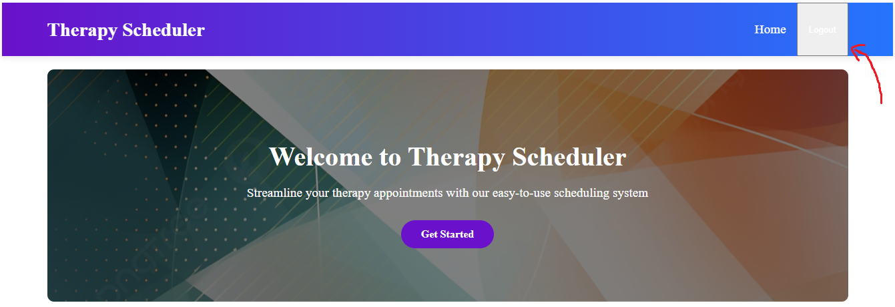

# Therapy Appointment Scheduler for Students with Mental Health Disorders

How to run backend:
1. cd to backend directory
2. npm install (one time)
3. node index.js

How to run frontend: 
1. cd to frontend directory
2. npm install (one time)
3. npm start

Breakdown of code and structure of project:
1. App.js in the frontend is the main entry point of the website, it uses react-router-dom to define routes, i.e 
/register for RegisterPage, /home for HomePage. These pages are located in /src/pages and are imported into App.js
like so: import LoginPage from './pages/LoginPage'; 
2. App.js imports navbar from /src/components which is the static navigation bar that the website always displays to the
user: 
3. Route and page details:  
    * pages/LoginPage.js - Login page with inputs {email, password}, redirects to /home on success
    * pages/RegisterPage.js - Register page with inputs {Name, email, password, role}
    * pages/HomePage.js - Displays default content regardless of login status
    * pages/StudentPage, pages/ParentPage, pages/TherapistPage - Upon successful login, redirect to role-specific 
    dashboards for student, parent, and therapist
4. After a successful login in LoginPage.js, set login status in the variable isLoggedIn to true in localStorage: localStorage.setItem("isLoggedIn", "true"); 
In app.js, retrieve the stored isLoggedIn value, and check if true; if true then update navbar's display to reflect
login status by havign a logout button. Navbar can track login status because it is passed the react state in App.js:
    * Navbar isLoggedIn={isLoggedIn} setIsLoggedIn={setIsLoggedIn} />
Navbar's new logout button appears when isLoggedIn == true, and once clicked, handleLogout is triggered which sets
the react state isLoggedIn to false, and redirects the user to the login page. 

5. The calendar functionality is implemented from the react-big-calendar library. When a therapist successfully logs in, they are sent to
their therapist page that features an interactable calendar UI. Clicking on a day on the calendar sets an appointment for that day in the form
of a bubble. Clicking on a bubble on a given day prompts the user to delete the appointment. 

